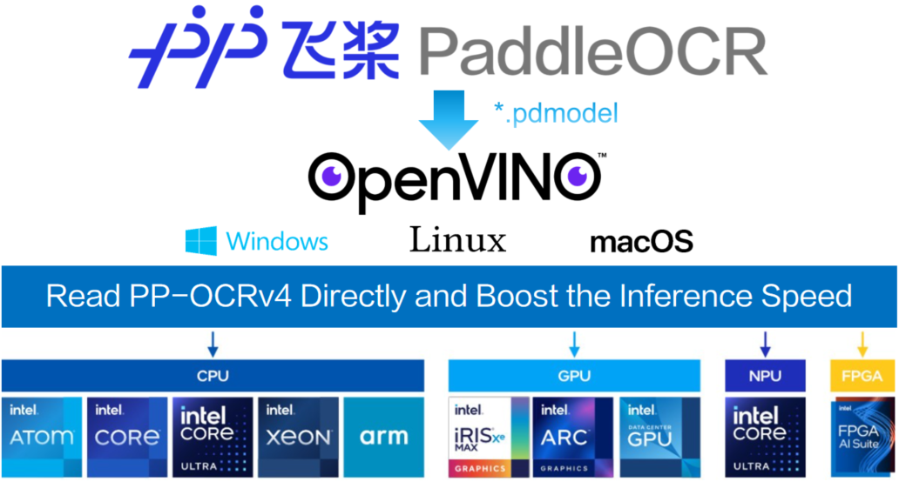

# PP-OCRv4_OpenVINO
<div style="text-align: center;">
    
</div>

## Introduction
PP-OCRv4_OpenVINO is a demo project that demonstrates how to perform inference using the [PP-OCRv4](https://github.com/PaddlePaddle/PaddleOCR/blob/main/README_en.md)  model with [OpenVINO](https://docs.openvino.ai/2024/index.html). The [PP-OCRv4 ](https://github.com/PaddlePaddle/PaddleOCR/blob/main/README_en.md) model is a remarkable general optical character recognition (OCR) solution, which not only provides **Chinese and English** models in general scenarios, but also provides multilingual models covering **80** languages.

**Run** this project on [aistudio](https://aistudio.baidu.com/projectdetail/8770259) directly, or run it locally as below.

## Installation
To install the necessary dependencies for this project, follow these steps:

1. Clone the repository:
    ```sh
    git clone https://github.com/openvino-book/PP-OCRv4_OpenVINO.git
    cd PP-OCRv4_OpenVINO
    ```

2. Create a virtual environment and activate it:
    ```shyi
    python3 -m venv venv
    source venv/bin/activate
    ```

3. Install the required packages:
    ```sh
    pip install -r requirements.txt
    ```

4. Download the PP-OCRv4 Model to PP-OCRv4_OpenVINO folder:
    ```sh
    # Download the detection model of PP-OCRv4
    wget https://paddleocr.bj.bcebos.com/PP-OCRv4/chinese/ch_PP-OCRv4_det_infer.tar && tar -xvf ch_PP-OCRv4_det_infer.tar

    # Download the recognition model of PP-OCRv4
    wget https://paddleocr.bj.bcebos.com/PP-OCRv4/chinese/ch_PP-OCRv4_rec_infer.tar && tar -xvf ch_PP-OCRv4_rec_infer.tar

    # Download the angle classifier of the PP-OCRv4
    wget https://paddleocr.bj.bcebos.com/dygraph_v2.0/ch/ch_ppocr_mobile_v2.0_cls_infer.tar && tar -xvf ch_ppocr_mobile_v2.0_cls_infer.tar
    ```

## Quick Start
To quickly start using the PP-OCRv4_OpenVINO project, follow these steps:

1. Run the inference script:
    ```sh
    python main.py --image_dir images/general_ocr_006.png \
        --det_model_dir ch_PP-OCRv4_det_infer/inference.pdmodel \
        --det_model_device CPU \
        --rec_model_dir ch_PP-OCRv4_rec_infer/inference.pdmodel \
        --rec_model_device CPU \
        --cls_model_dir ch_ppocr_mobile_v2.0_cls_infer/inference.pdmodel \
        --cls_model_device CPU \
        --use_angle_cls True
    ```

2. The recognized text will be printed to the console.


## Support other inference engines
Refer to [How to Support Other Inference Engines](./How to support other inference engines.md)
## License
This project is licensed under the MIT License. See the [LICENSE](LICENSE) file for more details.

## Acknowledgment
This project is based on the PP-OCRv4 model from [PaddleOCR](https://github.com/PaddlePaddle/PaddleOCR) and most of inference code comes from [OnnxOCR](https://github.com/jingsongliujing/OnnxOCR). We would like to thank the PaddleOCR team and @[jingsongliujing](https://github.com/jingsongliujing) for their contributions to the OCR community.
